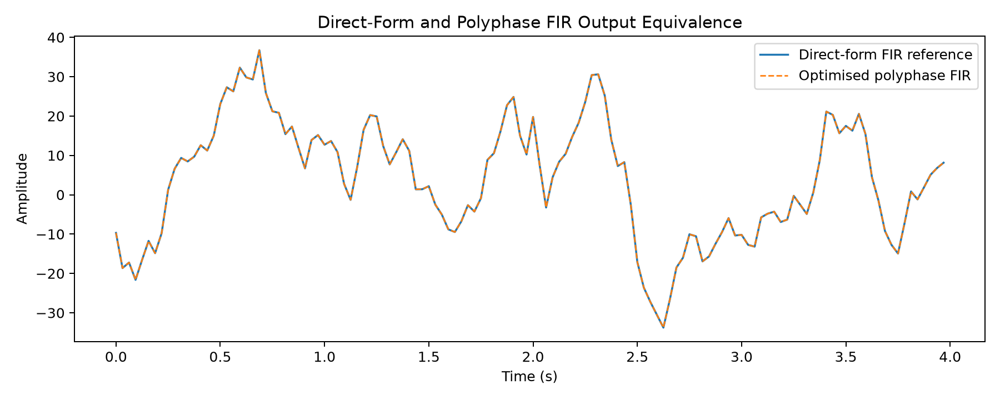
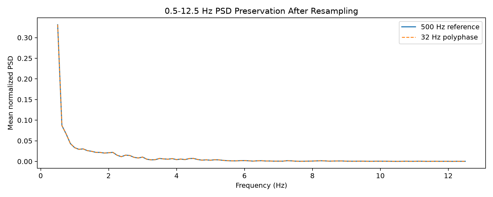
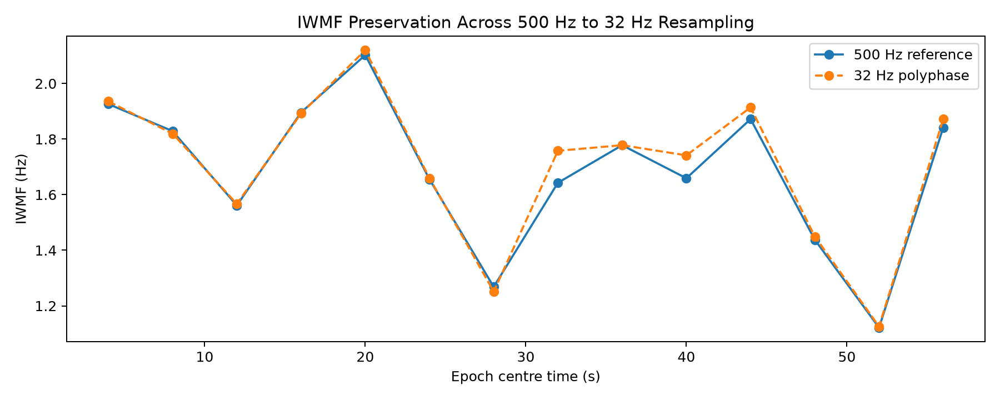

# EEG Multirate DSP with Polyphase FIR Optimisation

**500 Hz → 32 Hz EEG resampling**, with specification-driven anti-alias filtering, an explicit direct reference, and spectral-preservation validation.

[Engineering case study](https://derekamethy.github.io/eeg-multirate-dsp/) · [Primary source](src/dsp_pipeline.py) · [Recorded results](results/benchmark_results.json)

[](https://github.com/Derekamethy/eeg-multirate-dsp/actions/workflows/ci.yml)

**Yangdeyi Yang · UCC EE6041 Advanced Digital Signal Processing**

## Key results

The public benchmark reports these results for one **60 s, 30,000-sample EEG recording**. The recording is not redistributed, so these recording-dependent values cannot be independently reproduced from the public repository. The deterministic demo exercises the implementation with different data and produces different results.

| Metric | Recorded result |
| --- | ---: |
| Input / output sampling rate | 500 Hz → 32 Hz |
| Output samples | 1,920 |
| Direct/polyphase correlation / MSE | 1.000000 / 7.77e-27 |
| Median PSD-shape correlation | 0.999999996 |
| Median normalized-PSD relative RMSE | 0.0091% |
| Median band-power error: 0.5–4 / 4–8 / 8–12.5 Hz | 0.0277% / 0.0263% / 0.0318% |
| Spectral-entropy correlation | 0.999999998 |
| SEF95 RMSE / correlation | 0.000 Hz / 1.000 |
| IWMF RMSE / correlation | 0.0412 Hz / 0.9911 |
| Approximate FIR-operation reduction | 1000× |
| Measured median runtime speed-up | 118.79× (~119×) |

[benchmark_results.json](results/benchmark_results.json) is the authoritative numerical summary for the reported recording benchmark. The figures illustrate this recording; their underlying sample and per-epoch arrays are not included.

## Why this problem matters

Reducing the sampling rate lowers storage and downstream computation, but energy above the new 16 Hz Nyquist limit can alias into the retained spectrum. The engineering challenge is to protect the 0.5–12.5 Hz analysis band and reduce computation while preserving the same FIR resampling operation.

## My contribution

- Selected the exact rational conversion, protected band and anti-alias specifications.
- Designed the Kaiser FIR and implemented an explicit upsample-filter-decimate reference.
- Integrated SciPy's `resample_poly` with the same FIR coefficients and verified its output against the direct reference. The low-level polyphase kernel is provided by SciPy.
- Implemented epoch-level PSD, band-power, entropy, SEF95 and IWMF comparisons.
- Calculated core FIR workload, measured runtime separately, and supplied deterministic demo data and regression tests.

## Signal-processing pipeline

```text
500 Hz EEG → upsample ×8 → Kaiser FIR at 4 kHz → decimate ÷125 → 32 Hz EEG
     │                                                               │
     └────────── 8 s epochs, 50% overlap on both branches ──────────────┘
                          ↓
       Target-band PSD, band power, entropy, SEF95 and IWMF comparison
```

The polyphase implementation computes only the contributions needed at output instants; it does not allocate the zero-stuffed sequence. Both branches use 8 s windows: 4,000 and 256 samples respectively, giving **0.125 Hz bin spacing**, 97 bins in 0.5–12.5 Hz, and 14 epochs for a 60 s recording. Hann-window spectral resolution is broader than the bin spacing.

## Engineering decisions

| Decision | Reason / trade-off |
| --- | --- |
| Exact ratio `L=8`, `M=125` | Avoids rate approximation; intermediate design rate is 4 kHz. |
| Protected band 0.5–12.5 Hz | Leaves a 3.5 Hz transition before the output Nyquist limit. |
| Symmetric Kaiser FIR | Reproducible linear-phase design; long direct-form workload. |
| Same coefficients in both implementations | Separates implementation equivalence from spectral preservation. |
| Multiple spectral metrics | Tests shape, energy and features; does not establish clinical validity. |

## Anti-alias filter design

`design_resample_fir()` uses `kaiserord` with a **60 dB design target**, transition width `3.5/2000`, and an odd tap count. `firwin` uses a 14.25 Hz midpoint cutoff at 4 kHz. The result is **4,145 taps**, beta **5.65326**, and unit DC coefficient sum; resampling applies the interpolation gain of 8.

The benchmark response summary reports:

| Check | Saved value |
| --- | ---: |
| Gain at 12.5 Hz | -0.0095 dB |
| Sampled passband deviation | 0.0090 dB |
| Gain at 16 Hz | -60.32 dB |
| Minimum sampled stopband attenuation | 59.89 dB |

Frequency-response validation uses a dense 131,072-point grid together with direct evaluation at the 12.5 Hz and 16 Hz band edges. The minimum observed stopband attenuation is **59.89 dB**, approximately 0.11 dB below the nominal 60 dB design target, while passband deviation remains below 0.01 dB. These measurements are finite-grid checks rather than continuous-frequency bounds.

## Polyphase optimisation

For 30,000 input samples and 4,145 taps:

```text
Direct core:    N × L × taps = 994,800,000 MACs
Polyphase core: N × taps / M ≈   994,800 MACs
Ratio: L × M = 1000
```

This approximate steady-state comparison excludes boundary padding, phase-length rounding and library overhead. It compares against explicit zero-stuffed FIR filtering, not an already optimised decimator. The intermediate-array byte estimate in JSON describes two float64 arrays, not peak process memory.

The direct reference compensates the **2,072 intermediate-sample delay (0.518 s)** but does not flush its causal FIR tail. It returns 1,904 samples for this recording; equivalence is measured against the first 1,904 polyphase samples. Polyphase uses zero extension at both boundaries and returns `ceil(N × 8 / 125)` samples. The common prefix includes the start boundary transient; it is not a transient-free region. Both APIs use the default odd symmetric FIR for this alignment.



Timing uses three warm-ups per implementation, then 20 direct and 100 polyphase runs. The benchmark medians are 0.282287 s and 0.0023764 s. Their ratio is machine-dependent and separate from the MAC estimate. Timing includes allocation and resampling, excludes FIR design, and runs the two groups sequentially; it is not a controlled cross-platform benchmark.

## Spectral-preservation validation

`epoch_psd()` computes one-sided Hann periodograms with density scaling and no detrending. Both branches use the same frequency bins; no extra bandpass is applied. Incomplete trailing epochs are discarded, and only epochs complete on both branches are compared.

- **PSD shape:** divide each target-band PSD by its bin sum; compare Pearson correlation and RMSE relative to reference RMS per epoch. This discrete normalization sums to one; it is not a unit-integral PSD density.
- **Band power:** trapezoidal integration over each inclusive band. Shared boundary bins receive half-bin weights in adjacent bands.
- **Entropy:** Shannon entropy of normalized target-band bins, divided by `log(97)`.
- **SEF95:** first bin reaching 95% of cumulative target-band power; quantized to 0.125 Hz.
- **IWMF:** power-weighted mean target-band frequency from an unwindowed (boxcar) periodogram, unlike the Hann-based metrics.

Zero-power epochs cannot establish spectral preservation and are rejected. Pearson correlation of constant feature series is undefined and represented as JSON `null` in generated metrics.





## Repository structure

```text
src/dsp_pipeline.py             FIR, resampling, spectral metrics and timing
src/demo_data.py                Deterministic synthetic signal
src/__init__.py                 Package marker
run_analysis.py                CLI and figure generation
tests/test_pipeline.py          Engineering regression tests
results/benchmark_results.json  Saved recording benchmark
figures/                       Three recording-evidence PNGs
.github/workflows/ci.yml        Tests, compilation and demo
requirements.txt               Python dependencies
README.md / LICENSE            Project description and MIT license
.gitattributes / .gitignore     Repository configuration
```

## Quick start

Use **Python 3.11 or later**:

```bash
python -m venv .venv
# Windows: .venv\Scripts\activate
# macOS/Linux: source .venv/bin/activate
python -m pip install -r requirements.txt
python run_analysis.py
python -m unittest discover -s tests -v
```

The default run uses a 60 s synthetic EEG-like signal with seed 6041. It writes `results/demo_metrics.json` and three `figures/demo_*.png` files. Generated outputs are ignored by Git and do not overwrite the recording benchmark.

For your own recording:

```bash
python run_analysis.py --input recording.xlsx --label recording_name
```

Input must contain at least 8 s of uniformly sampled **500 Hz** data: numeric, finite values in the first column of the first worksheet, with no header, blank samples or timestamps in that column. Other columns are ignored. The sampling rate and units are assumed, not inferred. Labels accept letters, digits, underscores and hyphens, starting with a letter or digit.

## Reproducibility

CI installs dependencies, compiles the sources, runs regression tests and executes the demo. Tests cover arbitrary output lengths, impulse alignment, DC gain, achieved FIR response, epoch boundaries, known-tone PSD power and features, numerical equivalence, invalid input and approximate operation counts.

Dependencies have minimum versions rather than a frozen environment. Each run records Python, NumPy, SciPy and platform information; numerical rounding and timings can vary. The public benchmark does not include the original recording or complete hardware/software metadata, so its exact floating-point values and runtime cannot be independently reconstructed from this repository.

## Scope and limitations

Evidence covers one recording and 14 overlapping epochs, not independent subjects or a population study. Boundary transients are included; no transient-exclusion sensitivity experiment is supplied. Content above 16 Hz is attenuated, not perfectly eliminated, and preservation is evaluated only in 0.5–12.5 Hz. The finite filter misses a strict 60 dB stopband bound slightly.

The demo is synthetic and does not model EEG clinically. This project makes no clinical, diagnostic, seizure-detection or downstream model-performance claims.

## License

[MIT License](LICENSE) for source code. Third-party data and externally owned materials retain their original rights and terms.
